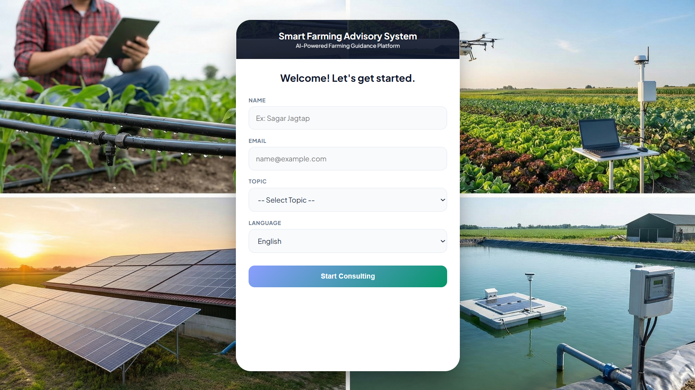
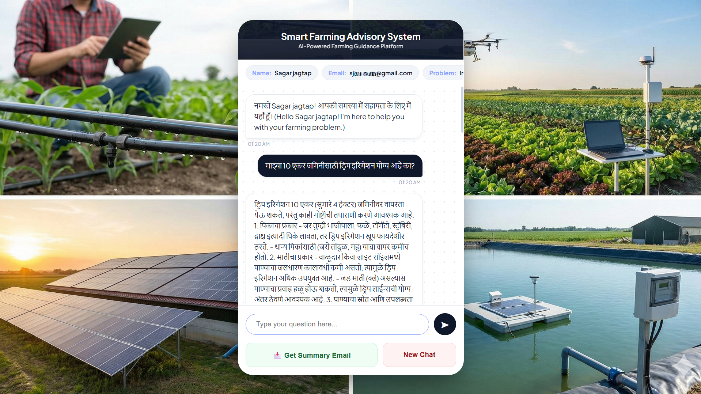

# 🌾 AI-Powered Smart Farming Advisory System  

An AI-driven, multilingual web application designed to assist Indian farmers with practical agricultural guidance. The system enables farmers to interact with an AI advisor, ask farming-related questions, and receive a consolidated solution via email — all through a simple, farmer-friendly interface.

---

## 📌 Project Overview

The **AI-Powered Smart Farming Advisory System** helps farmers get expert advice on:

* Crop management
* Irrigation techniques
* Fertilizers
* Pests & diseases
* Government farming schemes

The application is designed especially for **rural Indian farmers**, supporting **English, Hindi, and Marathi** to reduce language barriers. It uses an AI model via **Groq API** to provide intelligent, context-aware responses.

---

## 🎯 Core Objective

> To provide farmers with a simple, multilingual AI platform for reliable agricultural guidance and deliver a summarized solution via email.

---

## 🛠️ Technology Stack

| Layer                | Technology            |
| -------------------- | --------------------- |
| Programming Language | Java                  |
| Backend Framework    | Spring Boot           |
| Frontend             | HTML, CSS, JavaScript |
| AI Integration       | Groq API              |
| Email Service        | SMTP (Gmail)          |
| Session Management   | HTTP Session          |
| Build Tool           | Maven                 |
| Testing Tool         | Postman               |

---

## ✨ Key Features

* 🌐 **Multilingual Support** (English, Hindi, Marathi)
* 🤖 **AI-based Farming Advisory** using Groq API
* 🧑‍🌾 **Farmer-friendly UI** (simple and easy to use)
* 🔁 **Interactive AI Chat** with follow-up questions
* 📧 **One-time Final Solution Email**
* ⚡ **Fast Response Time**
* 🗃️ **No Database Required** (session-based handling)

---

## ⚙️ Functional Workflow

1. Farmer opens the web application
2. Enters basic details:

   * Name
   * Email
   * Problem type (crop, irrigation, etc.)
   * Preferred language
3. AI chat starts in the selected language
4. Farmer can ask multiple and follow-up questions
5. Conversation is temporarily stored in the session
6. Farmer clicks **“Get Final Solution”**
7. AI generates a summarized solution
8. Final advisory is sent **once** via email

---

## 🌍 Multilingual Support

Language selection is done before the conversation starts.
The selected language is dynamically injected into the AI system prompt, ensuring:

---

## 📸 Project Screenshots

### 🔹 Farmer Details & Language Selection

### 🔹 AI Chat & Advisory Interface

